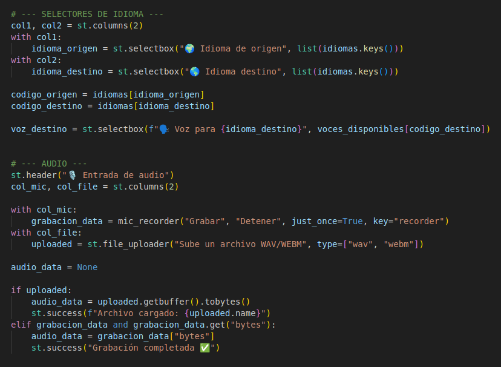
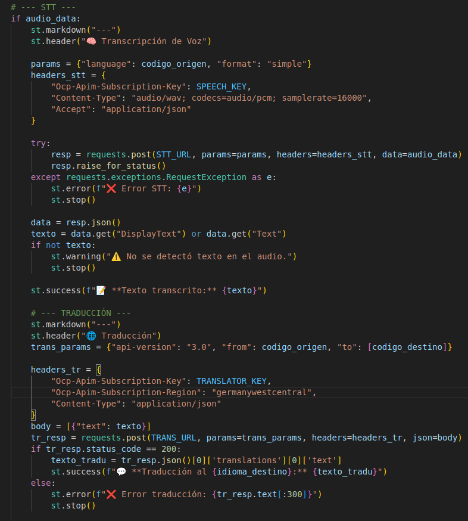
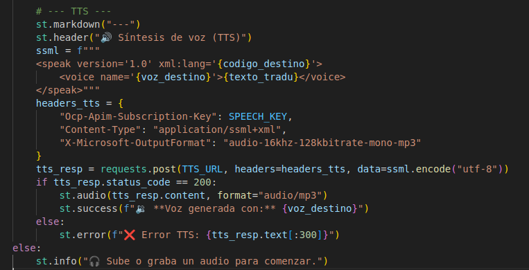

# 🌍 Traductor Multilingüe con Voz

Proyecto elegido: **Traductor multilingüe con voz (voz → texto → traducción → voz)**  

Para el tema de seguridad, he usado `st.secrets` de Streamlit, evitando exponer las claves en el código fuente.

Imports que necesitamos -> import streamlit as st,import requests,from streamlit_mic_recorder import mic_recorder

## Índice

1. [Descripción del Proyecto](#descripción-del-proyecto)  
2. [Tecnologías y APIs utilizadas](#tecnologías-y-apis-utilizadas)  
   - [1. Azure Speech-to-Text (STT)](#1-azure-speech-to-text-stt)  
   - [2. Azure Translator](#2-azure-translator)  
   - [3. Azure Text-to-Speech (TTS)](#3-azure-text-to-speech-tts)  
3. [Funcionalidades de la Aplicación](#funcionalidades-de-la-aplicación)  
4. [Funcionamento del Codigo](#4-como-funciona-el-codigo)

---

## Descripción del Proyecto

Esta aplicación permite a los usuarios grabar o subir un audio y obtener:

1. **Transcripción del audio a texto**  
2. **Traducción del texto a otro idioma**  
3. **Síntesis de voz del texto traducido**

El flujo completo se realiza usando **APIs de Azure**, proporcionando un procesamiento de voz y lenguaje rápido y confiable.

---

## Tecnologías y APIs utilizadas

He usado las APIs de Azure, concretamente:

### 1. Azure Speech-to-Text (STT)
- Convierte la voz en texto usando modelos neurales de Azure.  
- Permite seleccionar el idioma de origen para mejorar la precisión.  
- Configuración de audio: WAV o WEBM, 16 kHz, PCM.  
- Proporciona transcripción rápida y precisa de contenido hablado.  

### 2. Azure Translator
- Traduce el texto transcrito a cualquier idioma soportado por Azure.  
- Configuración con la versión `3.0` de la API.  
- Permite traducción bidireccional, manteniendo coherencia semántica.  
- Ideal para comunicación multilingüe instantánea.  

### 3. Azure Text-to-Speech (TTS)
- Convierte el texto traducido en voz de alta calidad.  
- Permite elegir la voz y el idioma de salida (p.ej., `ElviraNeural`, `JennyNeural`).  
- Salida en formato MP3 compatible con la mayoría de plataformas.  
- Facilita la creación de contenido accesible y multilingüe.  

---

## Funcionalidades de la Aplicación

- Interfaz **intuitiva y responsiva** usando Streamlit.  
- Grabación de audio directamente desde el navegador o subida de archivos existentes.  
- Selección de idiomas de origen y destino, con voces configurables.  
- Manejo de errores para cada API, mostrando mensajes claros al usuario.  

## 4. Cómo funciona el código

Esta sección explica cómo se procesa la entrada de audio en la aplicación.

--Selector de idioma 
Tenemos dos columnas donde la primera col1 es el selector de idioma origen donde tenemos una array en los idiomas para selecionar y en col2 tenemos el idioma destino 

---Audio---
Tenemos dos columnas con una opcion de grabar audio con mic_recorder que lo importamos o subir un archivo con file_uploader

1. Se inicializa `audio_data` como `None`.
2. Si el usuario sube un archivo, se convierte a bytes y se guarda en `audio_data`. uploaded es el nombre del archivo subido y grabacion_data es el grabado por micro del user
3. Si el usuario graba audio con el micrófono, también se guarda en `audio_data`.
4. Se muestra un mensaje de éxito indicando que el audio está listo para procesarse.

---STT---

Tenemos un if donde audio_data se ejecuta si tenemos algo cargado en la bariable audio_data

params definimos los parametros de consulta especificando el idioma de origen del audio creado o subido y el formato es simple. En el headers_stt definimos los parametros para la autentificacion y el tipo de contenido, en el content-type decimos que es audio wab con codificacion PCM y la frecuencia es de 16000 hz y despues en accept especificamos la respuesta en tipo json.

En resp enviamos la soicitud post con todos los parametros en raise_for_status comprobamos si tiene codigo de error. Mostramos si tenemos un error en el except 

Guardamos el conenido que nos devuelve en data en formato json 

comprovamos si nos devuelve el texto transcrito y si funciona en st.succes ponemos lo que nos devuelve en el json que guardamos en data 

--TRADUCION--

En traducion queremos enviar el texto que nos devuelve en el stt.
Para eso necesitamos entrar en la api de traducion donde lo hacemos en trans_parms donde especificamos los parametros necesarios como la api version el idioma origen y destino.

En el header enviamos la key la region y como queremos que nos devuelva el contenido en este caso json.En el body crea el cuerpo de la solicitud JSON, que es una lista que contiene un diccionario con el texto a traducir

en tr_resp enviamos el post.Comprovamos si nos saca algun error para hacer control de errores y si nos devuelve el 200 pasamos a sacar del json el texto traducido.

---TTS---

Aqui en esta seccion queremos enviar el texto traducido para crear un audio con el idioma seleccionado.

ssml = f"""...""": Crea el Speech Synthesis Markup Language (SSML). El SSML es un formato XML que instruye al servicio de TTS sobre cómo debe generarse la voz.

    <speak version='1.0' xml:lang='{codigo_destino}'>: Define el idioma base para la síntesis, utilizando el código del idioma destino.

    <voice name='{voz_destino}'>{texto_tradu}</voice>: Especifica la voz a utilizar (voz_destino) y encierra el texto a leer (texto_tradu).

En el headers_tts enviamos la key el ssml y el formato del audio que es MP3, mono, 16kHz, 128kbps.

enviamos el post en tts_resp y comprovamos el status_code si es igual a 200 sacamos el audio y sinos sacamos el error  

